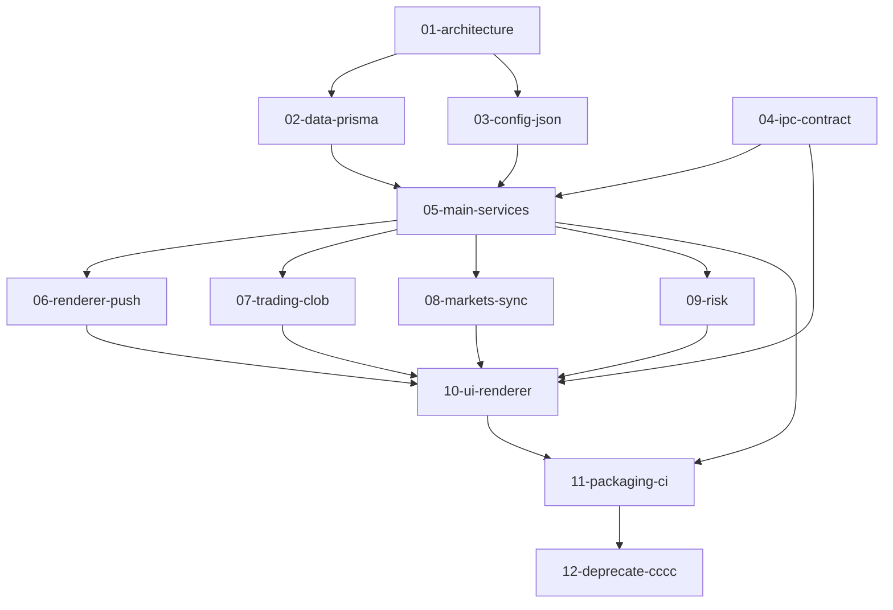

# Poly bot 迁入 Craft Electron（模块化计划）

本文档集描述：**全 IPC**、主进程服务、**SQLite + Prisma（业务）** + **JSON（配置）**、**官方 `@polymarket/clob-client-v2`**；完成后 **删除 `cccc/`**。

## 阅读顺序与开发顺序

按依赖从底向上开发；每一模块可单独 PR，但需标明依赖的前置模块。

| 顺序 | 模块 | 文档 | 说明 |
|------|------|------|------|
| 1 | 架构与边界 | [01-architecture.md](./01-architecture.md) | IPC 模型、与现有 bootstrap 关系、删除 cccc 的边界 |
| 2 | 数据层（Prisma / SQLite） | [02-data-prisma.md](./02-data-prisma.md) | 新包、schema 迁移、userData 路径、与 cccc 表结构对齐 |
| 3 | 配置（JSON） | [03-config-json.md](./03-config-json.md) | 替代 `BotConfig`、原子写、缓存、迁移旧数据 |
| 4 | IPC 契约与 Preload | [04-ipc-contract.md](./04-ipc-contract.md) | 通道命名、类型、preload 暴露、大 payload |
| 5 | 主进程服务与生命周期 | [05-main-services.md](./05-main-services.md) | 启动/停止顺序、heavy services、多窗口单例 |
| 6 | 主进程 → Renderer 推送 | [06-renderer-push.md](./06-renderer-push.md) | 替代 dashboard WebSocket、节流与取消订阅 |
| 7 | 交易与 CLOB | [07-trading-clob.md](./07-trading-clob.md) | 官方 npm 包、薄封装、与旧 fork 差异回归 |
| 8 | 市场与同步 | [08-markets-sync.md](./08-markets-sync.md) | Gamma/SX、Centrifugo、WS 入 Prisma |
| 9 | 风控 | [09-risk.md](./09-risk.md) | RiskPosition / RiskTask、与用户通道同步 |
| 10 | UI（Renderer） | [10-ui-renderer.md](./10-ui-renderer.md) | 页面迁入、Tailwind 4、替换 fetch/ws |
| 11 | 打包与 CI | [11-packaging-ci.md](./11-packaging-ci.md) | Prisma/libsql、electron-builder、三平台 |
| 12 | 下线 cccc | [12-deprecate-cccc.md](./12-deprecate-cccc.md) | 检查清单、删目录、可选删 `packages/clob-client-v2` |

## 仓库内旧参考（实施时对照，最终删除）

- Bot 逻辑：`cccc/bot/src/`
- Dashboard UI：`cccc/dashboard/src/`
- 旧本地 CLOB：`packages/clob-client-v2`（迁官方包后若无引用可删）

## 模块依赖关系（示意）

